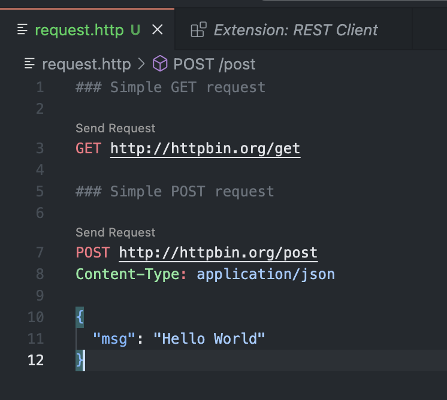

+++
authors = ["Hauke Jung"]
title = "VSCode REST Client"
description = "Why Developers should choose VSCode REST Client over Postman"
date = 2024-10-01
[taxonomies]
tags = ["vscode", "extension", "rest", "api", "testing"]
[extra]
toc = false
+++

Still using Postman or Insomnia for API testing? This article will show you why a developer should switch to the VSCode REST Client instead.

## The why ？

Postman and Insomnia are powerful tools for API testing, but they have drawbacks. Being standalone apps, they require constant window switching, which disrupts workflow, and lack integration with code editors, making consistency between API requests and codebase challenging. For this reason, developers are switching to alternative solutions.

## ⚙️ VSCode REST Client

The VSCode REST Client Extension offers a lightweight, integrated solution, running directly within your code editor. For developers seeking a seamless and efficient API testing experience, it’s an ideal alternative to traditional tools, minimizing workflow interruptions.

Key Features:
- Request Definition: Define HTTP requests using a Markdown-like syntax in .http or .rest files.
- Variable Support: Use variables to parameterize requests and responses.
- Environment Variables: Set environment variables for requests and responses.
- Version Control: Track changes to API requests over time using text-based files.
- Integration: Seamlessly integrate with VS Code, reducing window switching and maintaining consistency between requests and codebase.

## 🛠 Installation 

- Open VSCode and navigate to the Extensions panel.
- Search for “REST Client” and install the extension.

## 🚀 Getting Started 

To get started with the VSCode REST Client, follow these steps:

1. Create a new file with a .http or .rest extension.
2. Define your request using the Markdown-like syntax.
    ```markdown
    ### Simple GET request

    GET http://httpbin.org/get

    ### Simple POST request

    POST http://httpbin.org/post
    Content-Type: application/json

    {
        "msg": "Hello World"
    }
    ```
3. Run the request by clicking the “Send Request” button.
4. View the response data in the separate panel.


## ⭐️ Benefits:
**Seamless Integration in VS Code**

Switching between applications can disrupt your workflow. The VS Code REST Client keeps everything in one place, letting you send HTTP requests and view responses directly in your code editor. By staying within VS Code, you reduce the friction of hopping between windows, which is especially beneficial if you’re working on complex projects where every saved second counts.



**Variable support**

Support for variables, which can be defined in the .http or .rest files. Variables are defined using the @ symbol and can be referenced using the {{variable}} syntax. This allows you to parameterize requests and responses, making your API testing more dynamic and flexible. Environment variables 

```text
@hostname = api.example.com
@port = 8080
@host = {{hostname}}:{{port}}
@env_var = {{$dotenv [%]variableName}}

###

@name = Strunk & White

GET https://{{host}}/authors/{{%name}} HTTP/1.1
```

The extension also supports environment variables, which can be defined in the settings.json file. This allows you to set up different environments (e.g., local, staging, production) and switch between them easily. Environment variables can be shared across environments, making it easy to reuse values like tokens, URLs, and other constants.

```json
"rest-client.environmentVariables": {
    "$shared": {
        "version": "v1",
        "prodToken": "foo",
        "nonProdToken": "bar"
    },
    "local": {
        "version": "v2",
        "host": "localhost",
        "token": "{{$shared nonProdToken}}",
        "secretKey": "devSecret"
    },
    "production": {
        "host": "example.com",
        "token": "{{$shared prodToken}}",
        "secretKey" : "prodSecret"
    }
}
```

